# About this manual

This manual is for the operator who installs and runs CARI-IPTV under their own brand, and for the admin staff who manage channels, programme guides, movies, packages and subscribers day to day.

It is written from the platform as it exists in the code today. Where a feature looks available on screen but does not work as you would expect, this manual says so. Those points are collected in Appendix E.

Placeholders used throughout:

| Placeholder | Meaning |
|---|---|
| `<OPERATOR>` | Your company or brand name |
| `<ADMIN_DOMAIN>` | The domain name of the main server, for example `tv.example.com`. The admin panel, the subscriber web player and the API all live on this domain |
| `<VOD_DOMAIN>` | The domain name of the VOD server, for example `vod.example.com` |
| `<SERVER_IP>` | The IP address of a server before a domain is set up |
| `<BRANCH>` | The Git branch of the install scripts you were told to use. The scripts are pinned to a specific branch; ask your supplier which one |
| `<ADMIN_PASSWORD>`, `<DB_PASSWORD>`, `<VOD_API_KEY>` | Secrets generated at install time. Never write them in this document |

Screens in this manual were captured from the admin panel and the web player of this version. Your colours and logo will differ once you brand the platform.

# 1. Overview and architecture

## 1.1 What CARI-IPTV is

CARI-IPTV is a television middleware platform. It gives you:

- An **admin panel** where staff manage live channels, programme guides (EPG), movies, TV shows, subscription packages, subscribers, advertising and the look of the app.
- A **web player** that subscribers open in a browser on a computer, phone, tablet or smart TV to watch live TV and on-demand video.
- A **VOD server** that takes your video files and converts them into streaming formats that play smoothly on any device.
- Scheduled jobs that keep the programme guide fresh and build personalised recommendations.

CARI-IPTV does **not** receive, encode or relay live television. Live channels are supplied by your headend or a stream provider as stream URLs, and the platform simply points subscribers at them.

## 1.2 Components

```
                     Subscribers (browser on PC, phone, tablet, smart TV)
                                        |
                                        v
   +-----------------------------------------------------------------------+
   |  Main server  <ADMIN_DOMAIN>                                          |
   |    /admin    Admin panel (staff)                                      |
   |    /         Web player (subscribers)                                 |
   |    /api/v1   API used by the player                                   |
   |    MySQL database                                                     |
   |    Scheduled jobs: EPG fetch every 5 min, recommendations nightly     |
   +------+----------------------+-----------------------+----------------+
          |                      |                       |
          v                      v                       v
   VOD server <VOD_DOMAIN>   Live stream URLs      Internet services
   (transcodes and serves    from your headend     TMDB, Fanart.tv, YouTube,
    movies and episodes)     or provider           OpenSubtitles, IPTV-org,
                                                   optional OpenAI/Anthropic,
                                                   your SMTP mail server
```

| Component | Role | Who uses it |
|---|---|---|
| Admin panel | Everything staff do: content, packages, subscribers, settings | Operator staff |
| Web player | Watching TV and video, managing own account | Subscribers |
| VOD server | Converts uploaded video into adaptive streams (HLS/DASH). Has its own small web page for technical settings | Content staff, technical staff |
| Database (MySQL 8) | Stores all data. Installed on the main server automatically | Nobody directly |
| EPG fetch job | Downloads programme guides on a schedule | Runs automatically |
| Recommendation job | Builds "Recommended for you" rows overnight | Runs automatically |
| Local AI (Ollama) | Optional. Writes channel descriptions and ad text, produces analytics reports. Installed automatically; can be replaced by OpenAI or Anthropic | Staff, through the admin panel |

## 1.3 How subscribers see it

A subscriber goes to `https://<ADMIN_DOMAIN>/`, signs in, and sees a home screen you design in **App Layout**. From there they browse Movies, TV Shows, Live TV with a programme guide, Search and My List, and manage their account on the Profile page.

# 2. Requirements

## 2.1 Servers

You need at least two machines, or two virtual machines:

| Server | Purpose | Notes |
|---|---|---|
| Main server | Admin panel, web player, API, database, scheduled jobs | The installer also downloads about 9 GB of local AI models. Allow for that disk space, or plan to use a cloud AI provider and remove the models |
| VOD server | Video transcoding and streaming | Transcoding is CPU heavy. More cores mean faster processing. Storage must hold your whole video library. A fast disk for the temporary folder helps |

You can run both on one machine for testing. For production keep them separate so transcoding does not slow the admin panel and player.

## 2.2 Operating system

The install scripts support Ubuntu, Debian, CentOS, RHEL, Rocky Linux and AlmaLinux (`install.sh`, `vod-server/scripts/install.sh`). Ubuntu 22.04 or 24.04 is the simplest choice because the optional TSDuck package used for satellite EPG capture is available for those versions.

The database must be **MySQL 8**. MariaDB is not supported: the admin login uses MySQL-only syntax and fails on MariaDB. The installer installs MySQL 8 for you.

## 2.3 Network and ports

| Port | Server | Used for | Open to |
|---|---|---|---|
| 80 | Main | Admin, player and API over HTTP. Also needed for the Let's Encrypt certificate check | Internet |
| 443 | Main | HTTPS, once you install a certificate (section 3.7) | Internet |
| 8090 | VOD | VOD server API and streaming. Also its own web page | Main server and subscribers. See section 9 for why you should put it behind HTTPS |
| 80 / 443 | VOD | Only if you enable HTTPS on the VOD server itself | Internet |
| 3306 | Main | MySQL | Nobody. Local only |
| 11434 | Main | Local AI (Ollama) | Nobody. Local only |

The installer does **not** configure a firewall. Open and close ports yourself using your hosting provider's firewall or `ufw`.

Both servers need outbound internet access during installation, and the main server needs it during normal use to reach TMDB, Fanart.tv, YouTube, OpenSubtitles, IPTV-org and the two content delivery networks the player loads its video engine and fonts from.

## 2.4 Domains and TLS

- Choose a domain for the main server, `<ADMIN_DOMAIN>`. Staff and subscribers both use it.
- Choose a domain for the VOD server, `<VOD_DOMAIN>`.
- Point both domains at the servers before you install, so certificates can be issued straight after.
- The main installer sets up HTTP only. You add HTTPS yourself in section 3.7. Do not open the service to the public without HTTPS: passwords and session tokens would travel in clear text.

## 2.5 Accounts and keys to have ready

| Item | Why |
|---|---|
| An SMTP mail account (host, port, username, password) | Subscribers cannot complete sign-up without verification emails. Admin password reset emails also need it |
| TMDB API key | Movie and TV show metadata, artwork, cast. Free at themoviedb.org |
| Fanart.tv API key | Channel logos and high quality artwork. Free |
| YouTube Data API key | Trailer search and free-content import. Free with a daily quota |
| OpenSubtitles API key plus username and password | Subtitle search and download. Free tier is limited to 20 downloads per day |
| Optional: OpenAI or Anthropic API key | Only if you prefer cloud AI over the local model |

# 3. Installation

Install in this order. Each step ends with a check. Do not move on until the check passes.

## 3.1 Main server: admin panel, player, database

All of this is done by one script, `install.sh`. It installs Nginx, PHP 8.2, MySQL 8, the local AI runtime, the optional TSDuck tool, creates the database, loads the schema and all migrations, creates the first admin account, and installs the scheduled jobs.

1. Log in to the main server as a user with `sudo` rights.
2. Run the installer. Replace `<BRANCH>` with the branch you were given.

   ```bash
   curl -sSL "https://raw.githubusercontent.com/caritechsolutions/cari-iptv/<BRANCH>/install.sh?$(date +%s)" | sudo bash
   ```

   The script asks no questions. It generates a database password and an admin password for you.

3. To choose your own passwords and admin email instead, pass options after `--` (from the usage text in `install.sh`):

   ```bash
   curl -sSL "https://raw.githubusercontent.com/caritechsolutions/cari-iptv/<BRANCH>/install.sh?$(date +%s)" | sudo bash -s -- --admin-pass=<ADMIN_PASSWORD> --admin-email=admin@<ADMIN_DOMAIN>
   ```

   Other options: `--db-pass=`, `--install-dir=` (default `/var/www/cari-iptv`), `--port=` (default 80).

4. Wait. The AI model download is the slow part and can take a long time on a slow connection. It is not fatal if it fails.
5. At the end the script prints the admin URL, the username `admin` and the admin password. It also saves them to `/var/www/cari-iptv/INSTALL_CREDENTIALS.txt`.

**Check:** open `http://<SERVER_IP>/admin/login` in a browser. You should see the login page. Sign in as `admin` with the printed password. The Dashboard appears.

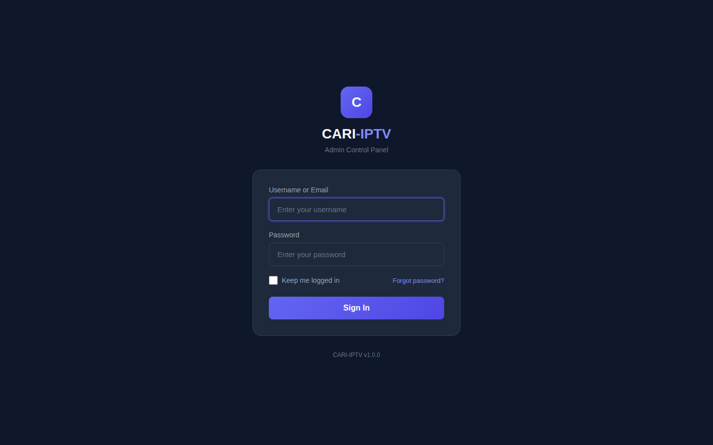

## 3.2 Database and migrations

The installer creates the database and runs every migration, so there is nothing to do on a fresh install. Later updates run any new migrations automatically (`update.sh`). Applied migrations are recorded in a `_migrations` table so they never run twice.

**Check:** in the admin panel, open **Channels**. The page loads and shows the demo channels the installer created. If the database was not set up you would see an error page instead.

## 3.3 First sign-in tasks

Do these before anything else.

1. Open the user menu (top right) and choose **My Profile**. Change the admin password.
2. Delete the credentials file on the server:

   ```bash
   sudo rm /var/www/cari-iptv/INSTALL_CREDENTIALS.txt
   ```

3. Go to **Settings > General**. Set **Site Name** to your brand and **Site URL** to `https://<ADMIN_DOMAIN>`. Save. Site URL is used inside verification emails and in stream links, so set it before subscribers sign up.
4. Go to **Settings > Email** and fill in your SMTP details. Tick **Enable SMTP**. Save. Use **Send Test Email** and confirm it arrives.
5. Remove the demo data: the installer adds demo channels, four demo packages named Basic, Standard, Premium and Annual Premium, and a demo movie. Delete the ones you do not want from **Channels**, **Packages** and **Movies**.

**Check:** the test email arrives, and the sidebar shows your Site Name.

## 3.4 VOD server

The VOD server has its own installer, `vod-server/scripts/install.sh`. It builds FFmpeg from source, so allow 20 to 60 minutes depending on the CPU.

1. Log in to the VOD server with `sudo` rights.
2. Run:

   ```bash
   curl -sSL "https://raw.githubusercontent.com/caritechsolutions/cari-iptv/<BRANCH>/vod-server/scripts/install.sh?$(date +%s)" | sudo bash
   ```

3. Near the end the script prints a box headed **SAVE YOUR API KEY**. Copy the key somewhere safe. This is `<VOD_API_KEY>`. If you lose it, read it back from the config file:

   ```bash
   sudo grep api_key /etc/vod-server/vod-server.conf
   ```

4. The script also prints the address of the VOD server's own web page: `http://<SERVER_IP>:8090`.

**Check:** run this on the VOD server. It must answer with JSON that includes `"status"`:

```bash
curl http://localhost:8090/api/status
```

Then open `http://<SERVER_IP>:8090` in a browser and confirm the VOD server dashboard loads.

## 3.5 Connect the VOD server to the admin panel

1. In the admin panel go to **Settings > Integrations**.
2. In the **VOD Servers** card click **Add Server**.
3. Fill in:
   - **Server Name**: for example `VOD 1`.
   - **Server URL**: `http://<SERVER_IP>:8090` (the address the main server uses to reach it, usually a private address).
   - **API Key**: `<VOD_API_KEY>`.
   - Tick **Default server** and **Active**.
4. Click **Test Connection**. You should see the server version, uptime and content count.
5. Click **Save Server**.

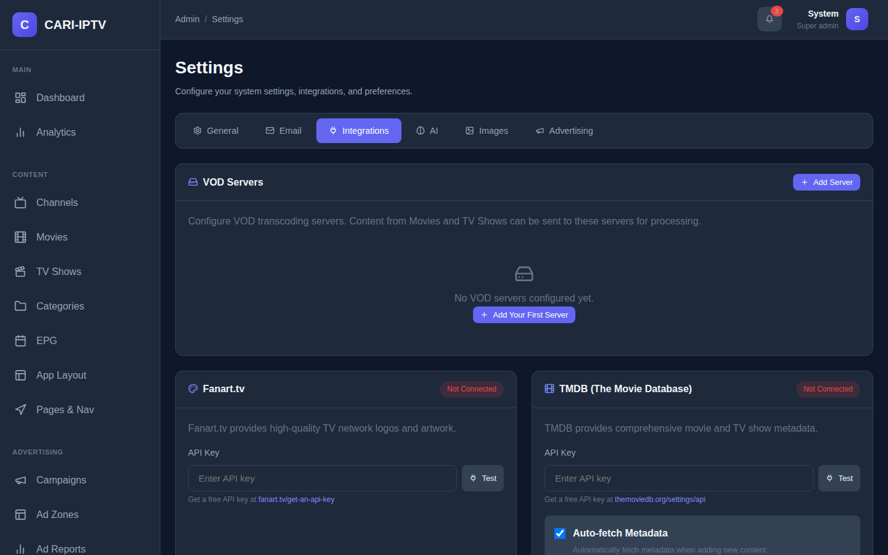

**Important:** the stream links given to subscribers are built from the Server URL, because the **Public URL** field is not available on this screen in this version (see Appendix E). Therefore the Server URL you enter here must be one that subscribers' browsers can also reach, for example `https://<VOD_DOMAIN>` once HTTPS is set up on the VOD server (section 3.8). If you enter a private address, movies will play for staff on the office network and fail for everyone else.

**Check:** Test Connection reports success and the card shows a green dot next to the server.

## 3.6 Headend and live sources

Live channels are external in this version. Your headend, encoder or stream provider gives you one HLS URL per channel (ending in `.m3u8`). You enter those URLs when you add channels (section 5.1). There is nothing to install for live TV on these servers.

**Check:** open one of your stream URLs in VLC or a browser that supports HLS. If it does not play there, it will not play in CARI-IPTV either.

## 3.7 HTTPS on the main server

The installer configures HTTP only. Add a certificate with Certbot, a standard tool that is not part of this repository.

1. Make sure `<ADMIN_DOMAIN>` already points at the main server.
2. Install Certbot and request a certificate. On Ubuntu:

   ```bash
   sudo apt install certbot python3-certbot-nginx
   sudo certbot --nginx -d <ADMIN_DOMAIN>
   ```

3. Choose the option to redirect HTTP to HTTPS when asked.

**Check:** open `https://<ADMIN_DOMAIN>/admin/login`. The browser shows a padlock and the login page.

## 3.8 HTTPS on the VOD server

The VOD installer includes Certbot and prints the procedure at the end of the install. In short (from `vod-server/scripts/install.sh`):

1. Edit `/etc/vod-server/vod-server.conf`. Under `[ssl]` set `enabled = true`. Under `[acme]` set `enabled = true` and `domain = <VOD_DOMAIN>`.
2. Restart: `sudo systemctl restart vod-server`.
3. Request the certificate:

   ```bash
   sudo certbot certonly --webroot -w /var/lib/vod-server/acme -d <VOD_DOMAIN>
   ```

4. Copy the certificate files into place and fix ownership:

   ```bash
   sudo cp /etc/letsencrypt/live/<VOD_DOMAIN>/fullchain.pem /etc/vod-server/ssl/cert.pem
   sudo cp /etc/letsencrypt/live/<VOD_DOMAIN>/privkey.pem /etc/vod-server/ssl/key.pem
   sudo chown vod-server:vod-server /etc/vod-server/ssl/*.pem
   sudo systemctl restart vod-server
   ```

5. Renewals are automatic. The installer added a renewal hook that copies new certificates and reloads the service.
6. Back in the admin panel, edit the VOD server and change its Server URL to `https://<VOD_DOMAIN>`.

**Check:** `https://<VOD_DOMAIN>/api/status` answers in a browser with a padlock.

## 3.9 Web player

The web player is part of the main server. There is nothing separate to install.

**Check:** open `https://<ADMIN_DOMAIN>/`. You are redirected to the subscriber login page.

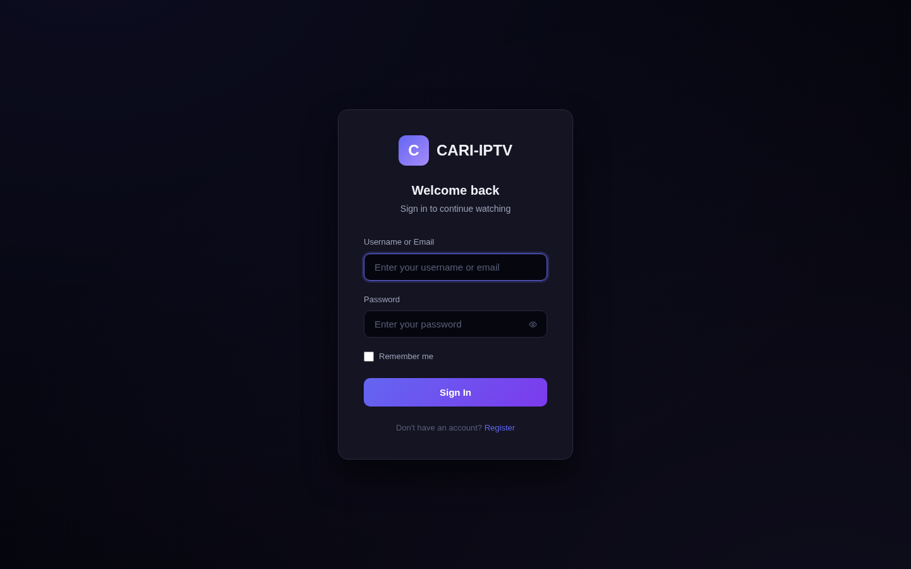

## 3.10 Go-live checklist

1. Admin password changed and credentials file deleted.
2. Site Name and Site URL set.
3. SMTP working (test email received).
4. TMDB, Fanart.tv, YouTube and OpenSubtitles keys entered and tested in **Settings > Integrations**.
5. HTTPS on both servers.
6. Demo channels, packages and movie removed.
7. At least one package created and linked to content groups (section 5.7). Until a package exists, every item in the player shows a padlock.
8. A published layout for the Web platform (section 5.9).
9. Firewall closed except ports 80 and 443 on the main server and 443 (or 8090) on the VOD server.

# 4. Configuration

## 4.1 Settings in the admin panel

Open **Settings** from the user menu (top right). There are six tabs.

### General

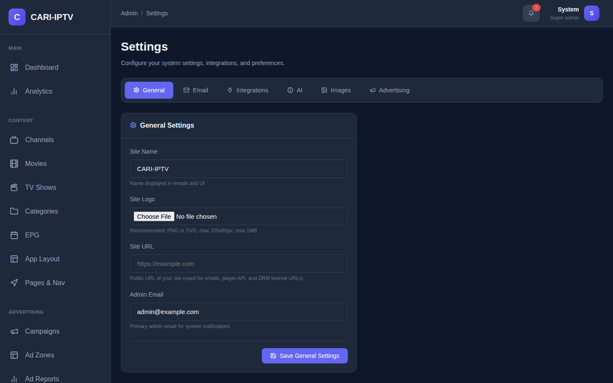

| Setting | Default | What it does | Recommended |
|---|---|---|---|
| Site Name | CARI-IPTV | Brand name in the player sidebar, browser tab and emails | Your brand |
| Site Logo | none | Image in the player and admin sidebar. PNG, SVG, JPEG, GIF or WebP up to 1 MB, about 200 by 60 pixels. Until set, a square tile with the first letter of the Site Name is shown | Your logo, light on dark |
| Site URL | empty | Used in verification email links, player links and DRM licence links | `https://<ADMIN_DOMAIN>` |
| Admin Email | admin@example.com | Address for system notifications | A monitored mailbox |

These are the only branding controls. Colours are fixed in this version.

### Email

| Setting | Default | Notes |
|---|---|---|
| Enable SMTP | off | Must be on for any email to be sent |
| SMTP Host, Port, Encryption | empty, 587, TLS | From your mail provider. TLS on 587 is the usual choice |
| Username, Password | empty | Mail account credentials. The password field shows blank after saving; leave it blank to keep it |
| From Email, From Name | empty, CARI-IPTV | What subscribers see as the sender |

Use the **Test Email** card after saving. If SMTP is not enabled and configured, registration appears to work but no verification email is ever sent, and the new subscriber can never sign in.

### Integrations

- **VOD Servers**: see section 3.5.
- **Fanart.tv** and **TMDB**: paste each API key and click **Test**. Both are saved by the single **Save Metadata Settings** button under the TMDB card. Leave **Auto-fetch Metadata** ticked.
- **YouTube Data API**: key plus **Save YouTube Settings**. The free quota allows roughly 100 searches per day.
- **OpenSubtitles**: API key, username and password, preferred languages as comma-separated two-letter codes (for example `en,es,fr`), and **Auto-fetch Subtitles** to search automatically when importing from TMDB. The username and password are required for downloads.

### AI

| Setting | Default | Notes |
|---|---|---|
| Enable AI Features | off | Turns on AI buttons across the panel |
| AI Provider | Ollama (Local) | Local is free and private. OpenAI and Anthropic need an API key and send text to their cloud |
| Ollama Server URL and Model | `http://localhost:11434`, `llama3.2:1b` | Click the refresh icon to list installed models. Larger models give better text but need more memory |
| OpenAI / Anthropic key and model | empty | Only for cloud providers |

Click **Test AI Connection** before saving.

### Images

Keep **Auto-optimize Images** on and **WebP Quality** at 85. This converts every uploaded logo and poster to a small WebP file, which makes the player load faster.

### Advertising

Controls when overlay ads appear during playback. Defaults: first banner after 30 seconds, shown for 15 seconds, repeated every 300 seconds; first text scroller after 15 seconds, repeated every 300 seconds. Set a repeat interval to 0 to show an ad only once per playback. Untick the enable boxes to switch overlays off entirely.

## 4.2 Files on the main server

You rarely need to touch these.

| File | Purpose |
|---|---|
| `/var/www/cari-iptv/.env` | Database connection, `APP_URL`, `APP_DEBUG`. Written by the installer. Keep `APP_DEBUG=false` in production so error details are not shown to visitors |
| `/etc/cron.d/cari-iptv` | The scheduled jobs. Rewritten by every update, so do not edit it |
| `/etc/nginx/sites-available/cari-iptv` | Web server configuration |
| `/var/www/cari-iptv/storage/logs/` | Application logs (section 8.3) |

## 4.3 VOD server configuration file

`/etc/vod-server/vod-server.conf` on the VOD server. Restart the service after any change: `sudo systemctl restart vod-server`. The settings you are most likely to change:

| Section and key | Default | Meaning |
|---|---|---|
| `[server] port` | 8090 | Port for the API, streaming and the web page |
| `[server] api_key` | generated at install | The key the admin panel uses. Treat as a password |
| `[storage] library_path` | `/var/lib/vod-server/library` | Where finished videos live. Put your large disk here |
| `[storage] temp_path` | `/var/lib/vod-server/tmp` | Working space during transcoding. Fast disk recommended |
| `[storage] min_free_space_gb` | 10 | Refuse new jobs below this much free space |
| `[transcoding] max_concurrent_jobs` | 2 | How many videos convert at once. Roughly half your CPU cores |
| `[transcoding] default_profile` | standard | Default quality ladder |
| `[transcoding] hwaccel` | none | `nvenc` for NVIDIA cards, `vaapi` or `qsv` for Intel. Read section 5.5.3 before enabling |
| `[ssl]`, `[acme]` | off | HTTPS, see section 3.8 |
| `[drm] enabled` | false | Encrypts stored video. See section 9 before relying on it |

If you move the library to another disk, the service also needs permission to write there. The installer explains this at the end of the install: add a `ReadWritePaths=` line for the new path to `/etc/systemd/system/vod-server.service` and run `sudo systemctl daemon-reload`.

Transcode profiles (quality ladders) are edited on the VOD server's own web page under **Profiles**, not in the admin panel.

# 5. Content

## 5.1 Channels

**Channels** in the sidebar lists your live TV channels.

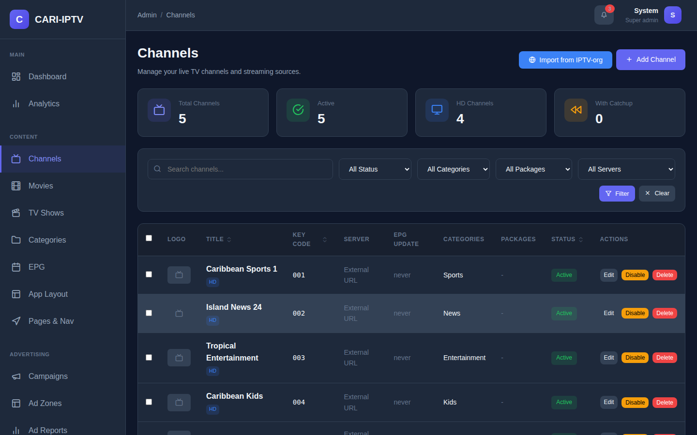

### Add a channel

1. Click **Add Channel**.
2. On the **Metadata** tab enter the **Title**. Everything else is optional.
3. In **Stream Settings** paste the **Stream URL** from your headend. HLS links ending in `.m3u8` are the format the player is built for. Tick **HD** or **4K** if you want the badge shown.
4. Optionally set a **Channel Number** and **Sort Order**. The player orders channels by Sort Order, then by name.
5. Under **Categories** tick one or more live categories and choose the **Primary Category**.
6. Add a **Logo**: upload a square image (about 400 by 400), or click **Search Logos** to find one on Fanart.tv and click **Apply to Logo**. A **Landscape Logo** (500 by 296) is optional.
7. Make sure **Active** is ticked. Click **Create Channel**.

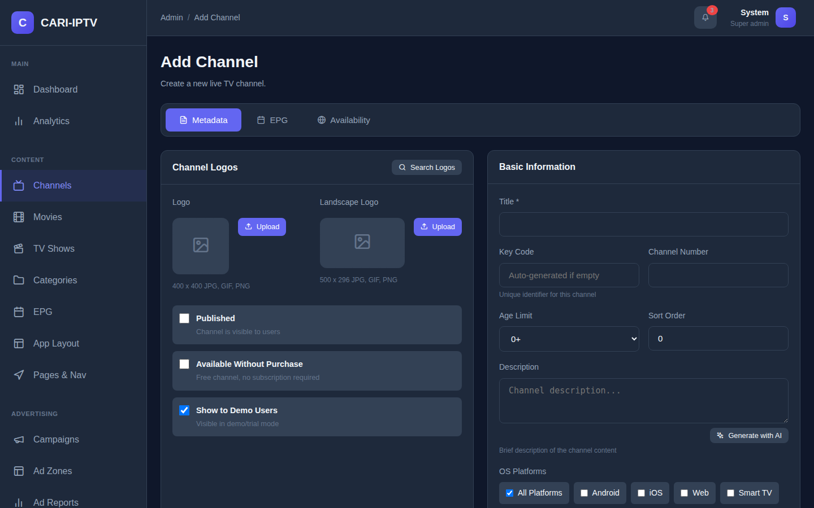

The **Key Code** is filled in automatically if you leave it blank. It is a short unique number staff can use to find the channel.

### Which settings actually affect subscribers

Only two things on this form change what subscribers see:

- **Active** (in Stream Settings). An inactive channel disappears from the player immediately. Use the **Disable** button in the list, or the bulk **Deactivate** action, to take a channel off air quickly.
- **Categories**, which drive the Categories page and category rows in layouts.

The following are recorded but not used by the player in this version, so treat them as notes for staff: **Published**, **Available Without Purchase**, **Show to Demo Users**, **Age Limit**, **OS Platforms**, **Backup Stream URL**, **Streaming Server**, **Content Owner**, **Catchup**, and the **Include in Packages** checkboxes. To control who can watch a channel, use Content Groups (section 5.7), not the Packages box on this form.

### Import channels from IPTV-org

IPTV-org is a public directory of free-to-air streams. It is the only bulk import in this version; there is no M3U playlist import.

1. On the Channels list click **Import from IPTV-org**.
2. Pick a **Country** and optionally a category, or use the quick buttons for Caribbean countries, then **Search**.
3. Use **Preview** to test a stream.
4. Tick the channels you want and click **Import**.

Imported channels arrive **Active**, with logo, country and language filled in. Channels whose name or stream URL already exists are skipped. The importer matches IPTV-org category names to your live categories by name; unmatched ones are left without a category.

### Edit, disable, delete

- **Edit** opens the same form. The **EPG** tab on an existing channel shows which guide sources it is mapped to and the next programmes. Mapping itself is done on the EPG page (section 5.3).
- Tick several rows to use the bulk bar: **Activate**, **Deactivate**, **Delete**.
- Deleting a channel is immediate and cannot be undone.

## 5.2 Categories

**Categories** are the genres subscribers browse by. Each category has a type: **Live TV**, **Movies** or **TV Shows**. A channel can only use live categories, a movie only movie categories, and so on.

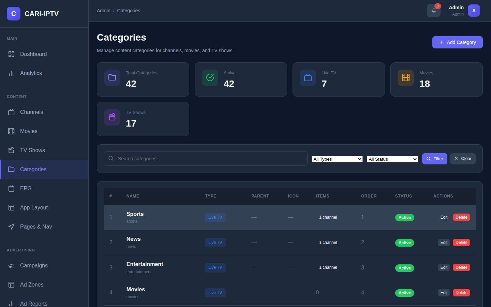

1. Click **Add Category**.
2. Enter a **Name** and choose the **Type**. The type cannot be changed later; delete and recreate instead.
3. Optionally pick a **Parent Category** (one level of nesting) and an **Icon Class** such as `lucide-film`.
4. Save.

Drag rows to reorder. A category cannot be deleted while any channel, movie or show uses it, or while it has sub-categories.

When you import a movie or show from TMDB, its genres are created as categories automatically if they do not exist yet.

## 5.3 EPG (programme guide)

**EPG** in the sidebar manages guide sources and links guide channels to your channels.

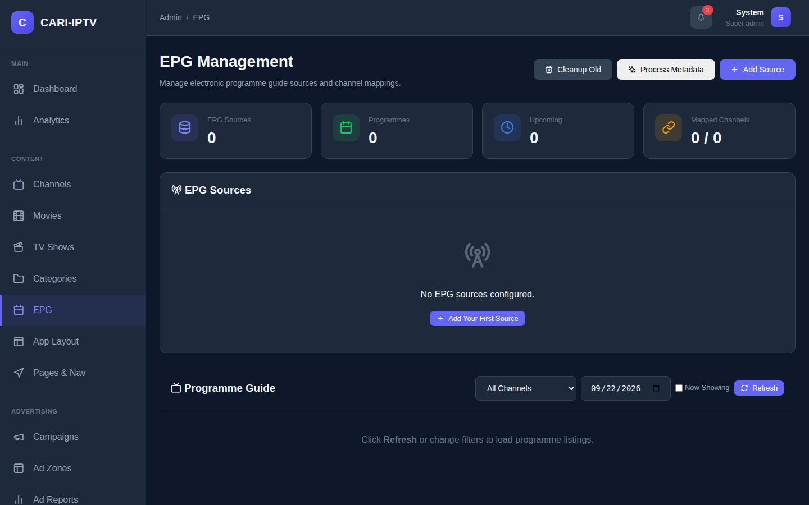

### Source types

| Type | What you enter | When to use |
|---|---|---|
| XMLTV URL | A web address of an XMLTV file (`.xml` or `.xml.gz`) | Your EPG provider gives you a link. Refreshes automatically |
| XMLTV File Upload | Nothing at first; you upload the file afterwards with the **Upload** button | You receive files by email or download. Must be uploaded by hand each time |
| EIT / DVB (MPTS Stream) | Multicast address, port, EIT PID (usually `0x12`) and a capture timeout | Your headend carries the guide inside the satellite transport stream. Requires the TSDuck tool, which the installer tries to add |

### Add a source

1. Click **Add Source**.
2. Enter a **Name** and choose the **Type**, then the fields for that type.
3. Tick **Active**. Tick **Auto Refresh** and choose a **Refresh Interval** (every hour is a sensible default).
4. Set **Source Timezone** to the timezone the guide times are written in. Leave at UTC for DVB sources. For XMLTV, times that already carry an offset are converted correctly whatever you choose here.
5. Save.

### Map channels

Guide data is only stored for channels that are mapped. A new source imports nothing until you map it.

1. On the source row click **Channel mappings**.
2. Click **Auto-Map**. It matches guide channels to your channels by name.
3. Review the list. Auto-map uses a partial name match as a fallback, so similar names such as "Sports 1" and "Sports 10" can be mismatched. Correct any wrong rows with the **Map To Channel** dropdown, and map the ones it missed.
4. Close the dialog and click **Fetch now** on the source.

**Check:** the **Programmes** count on the source row is no longer zero, and the **Programme Guide** panel at the bottom of the page lists programmes for a mapped channel.

### How refreshing works

A job runs every five minutes and fetches any URL or DVB source whose refresh interval has passed (`/etc/cron.d/cari-iptv`, installed by `install.sh`). File-upload sources are never refreshed automatically. Old programmes are deleted every night at 02:00.

Note that re-fetching an XMLTV source replaces all of that source's programmes, including past ones. DVB sources keep the past seven days.

### Programme artwork (TMDB metadata)

After each import, programme titles are looked up on TMDB so the player can show posters, synopses and cast for what is on. This needs the TMDB key from Settings. The **Programme Metadata** card shows how many titles are pending, enriched or not found. Click **Process Metadata** to run the lookup by hand.

## 5.4 Movies

**Movies** in the sidebar is your on-demand film library.

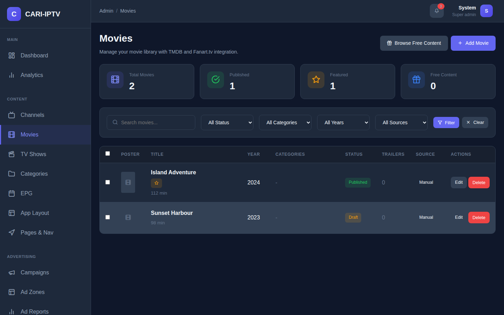

### Add a movie from TMDB (recommended)

1. Click **Add Movie**.
2. In **Search TMDB** type the title and click **Search**.
3. Click the correct result. The form fills with title, year, synopsis, runtime, director, genres, poster and backdrop. Cast, trailers and genre categories are imported too.
4. Set **Status** to **Published** if you want it visible now, or leave it as **Draft** while you add the video.
5. Click **Create Movie**.

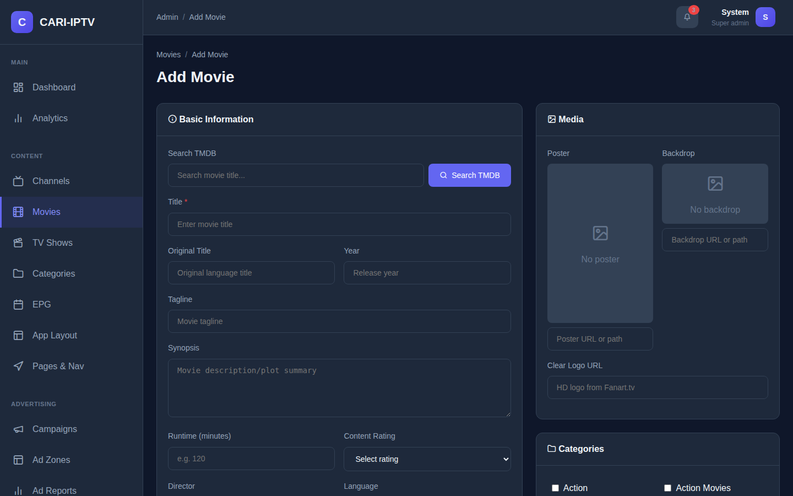

### Add a movie by hand

Only **Title** is required. Fill in what you have, upload or paste a **Poster** and **Backdrop** in the Media card, and save.

### Give the movie a video

There are two ways. Both put the playable link into the **Primary Stream URL** field.

- **You already have a stream URL** (for example from another streaming server): paste it into **Primary Stream URL** and save.
- **You have a video file**: use the VOD server. Save the movie first, then follow section 5.5.

### Publish

A movie only appears in the player when **Status** is **Published**. Use the bulk **Publish** and **Draft** actions on the list to change several at once. **Archived** hides a movie without deleting it.

Tick **Featured Movie** to make it eligible for hero and featured rows in layouts.

### Artwork, trailers, subtitles, markers

On the edit page of a saved movie:

- **Browse Fanart.tv** (Media card) offers posters, backdrops and clear logos when the movie has a TMDB id.
- **Search Trailers** finds YouTube trailers. Imports from TMDB already include trailers.
- **Subtitles** card: **Search OpenSubtitles**, **Extract** subtitle tracks that are embedded in the video file, or **Upload** an `.srt`, `.vtt` or `.ass` file (5 MB maximum) with its language. One subtitle per language. Click the star to make one the default.
- **Content Markers** card (shown once the movie has a stream): play the preview, pause at the right moment and click **Intro Start**, **Intro End**, **Credits Start** or **Ad Cue Point**. The player uses these for Skip Intro, Next Episode and mid-roll ads.

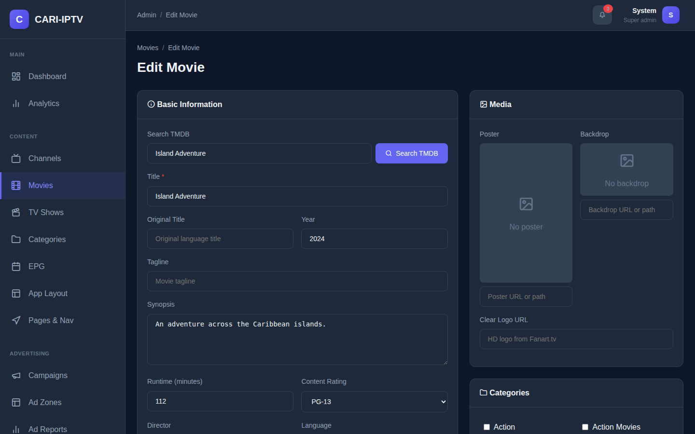

### Free content

**Browse Free Content** searches the Internet Archive and YouTube Creative Commons for films you can add at no cost. Check the licence terms of each item yourself before publishing it.

## 5.5 Uploading and packaging VOD

The VOD server converts one source file into a set of quality levels (a "ladder") and packages them so the player can switch quality as the connection changes. This is done from the movie or episode page.

### 5.5.1 Prepare the file

Read this before uploading. The player must work on phones, tablets, smart TVs and desktop browsers, and phones are the strictest.

**Target format: 8-bit H.264, High profile, 4:2:0 colour (yuv420p), stereo AAC audio.** This is what every phone, tablet, smart TV and browser decodes in hardware.

**Why 10-bit files fail on phones.** Some source files, especially HEVC rips, animation and HDR masters, use 10-bit colour (called High 10 or Hi10P in H.264, Main 10 in HEVC). Phone chips only decode 8-bit H.264 in hardware. Given a 10-bit stream, a phone either refuses to play it, plays audio with a black picture, or falls back to software decoding which stutters and drains the battery. The VOD server's normal (software) encoding path converts everything to 8-bit 4:2:0 automatically, so 10-bit sources are fine **as long as hardware acceleration is off** (the default). If you turn on `hwaccel` on the VOD server, no colour conversion is forced and a 10-bit source can come out as a 10-bit stream that phones cannot play. Keep hardware acceleration off unless you convert sources to 8-bit first.

**HDR is not converted.** The VOD server does not tone-map HDR (PQ or HLG, BT.2020) sources to standard range. An HDR master will come out washed out and dark. Convert HDR sources to SDR before uploading.

**Aspect ratio is not preserved.** Each quality level is scaled to a fixed 16:9 size (for example 1280 by 720). A 4:3 or cinema 2.39:1 source will be stretched. Pad non-16:9 sources to 16:9 before uploading.

**No upscale guard.** The ladder always produces every level in the profile, so a 480p source uploaded with the standard profile also produces a 1080p file that is no sharper but costs bandwidth. Use the **Low Bandwidth** profile for low resolution sources.

If you have a source that breaks any of these rules, run it through FFmpeg first. This is a standard tool, not part of the platform. A safe conversion that produces 8-bit H.264 High profile, converts HDR to SDR and pads to 16:9 is:

```bash
ffmpeg -i source.mkv \
  -vf "zscale=t=linear:npl=100,format=gbrpf32le,zscale=p=bt709,tonemap=tonemap=hable:desat=0,zscale=t=bt709:m=bt709:r=tv,format=yuv420p,scale=1920:1080:force_original_aspect_ratio=decrease,pad=1920:1080:(ow-iw)/2:(oh-ih)/2" \
  -c:v libx264 -profile:v high -pix_fmt yuv420p -preset slow -crf 18 \
  -c:a aac -b:a 192k -ac 2 \
  prepared.mp4
```

For a plain SDR 16:9 source that is merely 10-bit, the shorter form is enough:

```bash
ffmpeg -i source.mkv -c:v libx264 -profile:v high -pix_fmt yuv420p -preset slow -crf 18 -c:a aac -b:a 192k -ac 2 prepared.mp4
```

Accepted upload formats: any video file, including `.mp4`, `.mkv`, `.avi`, `.ts` and `.m2ts`. The main server accepts uploads up to 12 GB.

### 5.5.2 Choose a profile

| Profile | Output | Use for |
|---|---|---|
| Standard (H.264 ABR) | 360p, 480p, 720p, 1080p in H.264 | **Default. Use this for anything subscribers watch on phones or in browsers** |
| Low Bandwidth (H.264) | 360p, 480p, 720p at lower bitrates | Low resolution sources, or markets with slow connections |
| High (HEVC) | 480p to 1080p in HEVC | Smaller files, but HEVC does not play in every browser (Firefox and older Chrome do not support it). Only if you control the devices |
| HEVC 4K | up to 2160p in HEVC | 4K masters for smart TVs. Same browser caveat |
| AV1 (Web/Mobile) | 480p to 1080p in AV1 | Newest devices only |

### 5.5.3 Upload and transcode a movie

1. Open the movie's edit page. The **VOD Transcode** card is shown once at least one VOD server exists.
2. Choose the **VOD Server** and the **Transcode Profile**.
3. Click **Source File** and pick the prepared video.
4. Click **Upload & Transcode**. The upload progress bar runs first, then the job is queued.
5. If a video for this movie already exists on the server, you are asked whether to overwrite it.
6. The badge shows **Processing** with the current step (Downloading source, Transcoding, Packaging for streaming) and a percentage. You can leave the page; the status updates when you return, and the Movies list shows the percentage in the Status column.
7. When it finishes the badge shows **Ready** and the message "Transcode complete. Stream URL has been set." The **Primary Stream URL** now points at the VOD server. Anything that was in that field before is replaced.
8. Set **Status** to **Published** and save.

**Check:** sign in to the player as a test subscriber with a package that includes the movie, open it and confirm it plays and that the quality switches when you change the network.

If the badge shows **Failed**, hover or read the error text. The most common causes are a corrupt source file, not enough free disk space on the VOD server (below `min_free_space_gb`), or the VOD server being unreachable. Fix the cause and click **Upload & Transcode** again.

**Remove VOD** deletes the converted video from the VOD server and clears the stream link.

### 5.5.4 Episodes

The same card is available per episode in the **VOD & Markers** dialog on the Episodes page (section 5.6).

### 5.5.5 The VOD server's own web page

`http://<VOD_DOMAIN>:8090` (or `https://<VOD_DOMAIN>` after section 3.8) shows Dashboard, Content, Jobs, Uploads, Cluster, Profiles, DRM and Settings. Content staff mostly use **Jobs** to watch the queue and **Content** to see what is stored. Technical staff use **Profiles** to add or change quality ladders and **Settings** to change the options from section 4.3 without editing the file.

## 5.6 TV Shows

**TV Shows** works like Movies, with seasons and episodes underneath.

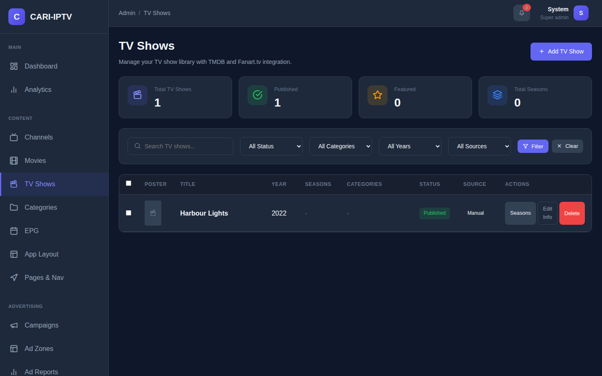

1. Click **Add TV Show**, search TMDB, pick the result, save.
2. Click **Manage Seasons** (or the Seasons button in the list).
3. Click **Import Seasons from TMDB** to create all seasons, or **Add Season** by hand.
4. On a season card click **TMDB** to pull that season's episode names, synopses, air dates and stills.
5. Click **Episodes** on the season.
6. For each episode either paste a **Stream URL (Primary)** in the episode's **Edit** dialog, or open **VOD & Markers** and upload a file exactly as for a movie.
7. Set the show's **Status** to **Published**.

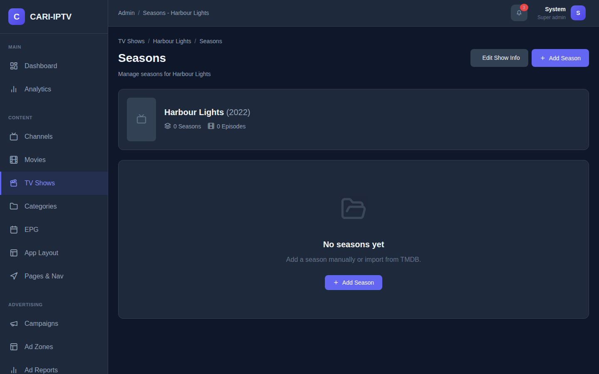

Each episode row also has **Subtitles** (search OpenSubtitles or upload) and the **VOD & Markers** dialog, where you set Intro Start, Intro End and Credits Start so the player can offer Skip Intro and Next Episode.

## 5.7 Packages, content groups and entitlements

Subscribers only see content as available when they hold a package that grants it. Two objects work together:

- A **Content Group** is a bundle of channels, movies, shows or whole categories.
- A **Package** is what a subscriber subscribes to. It has a price and grants one or more content groups.

Both are managed on the **Packages** page, which has a **Content Groups** tab and a **Packages** tab.

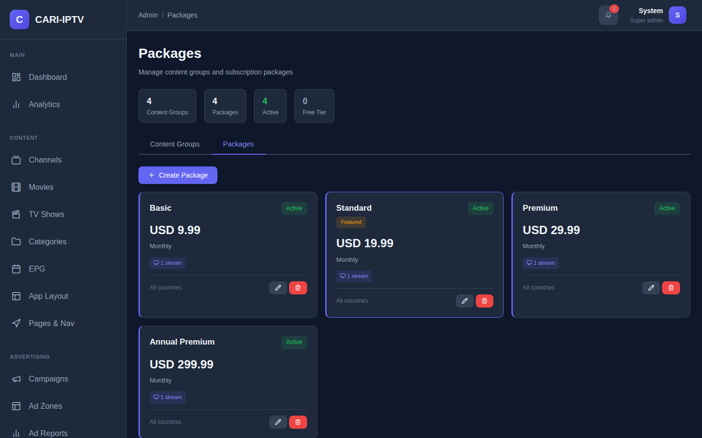

### Create a content group

1. Open **Content Groups** (sidebar link, or the tab).
2. Click **Create Content Group**. Enter a name such as "Basic Channels" and a colour. Save.
3. Click **Manage Content** on the group card.
4. Choose a type (Channels, Movies, Series, Categories), search, and click items to add them. Adding a category adds everything in it.
5. Click **Done**.

The installer seeds four empty groups: Basic Channels, Premium Channels, Movies Library, TV Shows Library. Rename or delete them as you like.

### Create a package

1. On the **Packages** tab click **Create Package**.
2. Enter the **Package Name** and a **Description** customers will see.
3. Pricing: tick **Free Package** for a free tier, or enter **Price**, **Currency**, **Billing Period**, tax settings and **Trial Days**.
4. Features and limits: **Simultaneous Streams**, **Video Quality**, **Catch-up TV**, **Cloud DVR**, **Ad-Free**. These are shown to customers as feature tags.
5. **Assign Content Groups**: select the groups this package grants. Hold Ctrl or Cmd to select several.
6. Leave **Active** ticked. Tick **Featured** to highlight it on the Subscribe page. Save.

### What is enforced, in plain terms

- A subscriber with **no package at all** sees a padlock on everything.
- Content that is in **at least one** content group is locked unless one of the subscriber's packages grants a group containing it.
- Content that is in **no** content group is open to every signed-in subscriber. New channels and movies start this way, so add new content to a group if it should be paid-only.
- The padlock is applied by the player app. The server itself does not withhold stream links from a subscriber who lacks the package (see section 9). Treat packages as the way you present and sell tiers, and keep this limitation in mind.
- **Simultaneous Streams**, **Video Quality**, **Catch-up**, **DVR**, **Platforms** and **Countries** on a package are descriptive only in this version. The stream limit that is actually applied is the per-subscriber **Max Concurrent Connections** (section 6.5).

### Free tiers and trials

- A free package is activated instantly when a subscriber chooses it on the Subscribe page.
- A paid package with **Trial Days** greater than zero starts a trial the first time a subscriber chooses it. When the trial ends the package is no longer counted.
- A paid package without a trial, or after the trial, shows "Payment is required". There is no payment gateway in this version. Staff activate paid packages by editing the subscriber (section 6.6).

## 5.8 Advertising

**Campaigns** is where ads are managed. The basic flow is: create a campaign, add one or more ads to it, then place each ad in a zone.

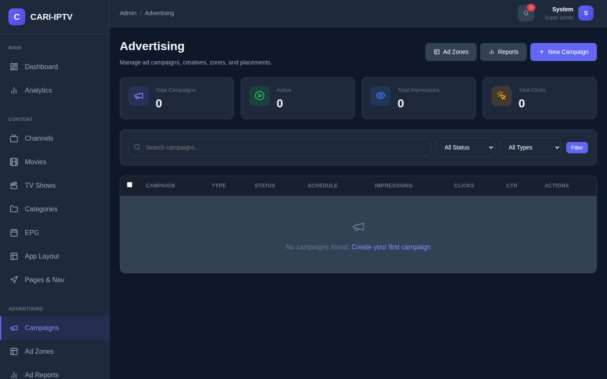

### Ad types

| Type | Where it shows | What you supply |
|---|---|---|
| Text Scroller | A ticker over the video | Text, speed, font size, colours. **Generate with AI** writes copy for you |
| Banner Image | An image over the video, top or bottom | Upload an image, paste a URL, or generate one with AI. Optional click URL |
| Pre-Roll Video | Before the content starts | Upload a video, paste a video URL, or a VAST tag URL. Duration and skip-after seconds |
| Mid-Roll Video | During the content | Same as pre-roll, plus where to insert: a percentage, a number of seconds, or the Ad Cue markers set on the movie |

### Create a campaign

1. Click **Create Campaign**.
2. Enter **Campaign Name** and **Advertiser**. Set **Status** to **Active** when ready (Draft campaigns do not serve).
3. Optionally set **Start Date** and **End Date**, daily and total budgets, a **Frequency Cap** (max times per user per day) and impression caps.
4. Click **Create Campaign**. The page reopens with two more tabs.

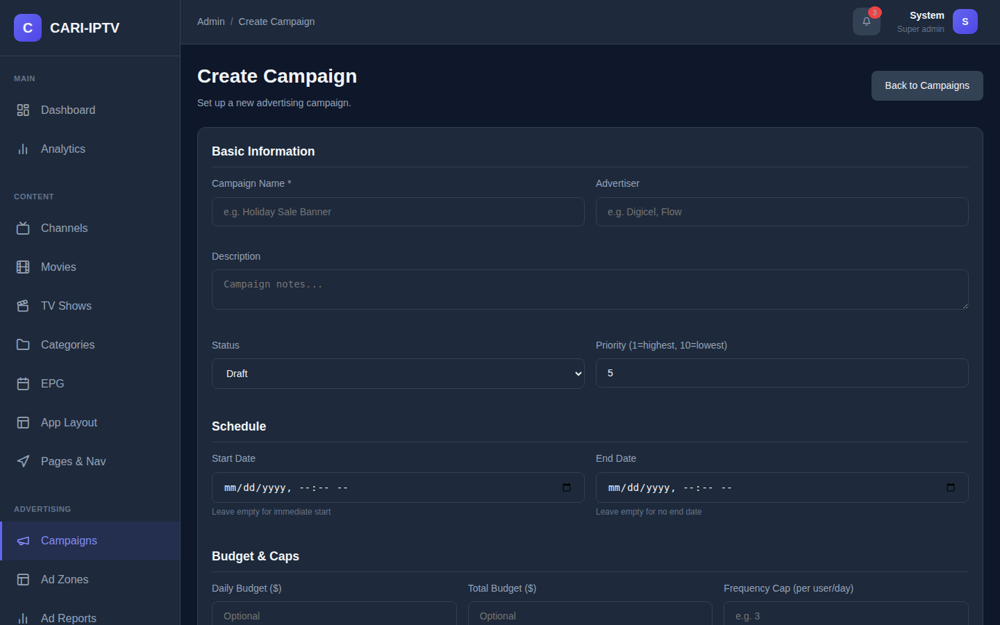

### Add an ad

1. On the **Ads** tab click **Add Ad**.
2. Enter a **Name**, choose the **Type**, and fill the settings for that type. Set **Status** to Active.
3. **Weight** controls rotation when a campaign has several ads of the same type.
4. Save.

### Place the ad

1. On the **Placements** tab click **Add Placement**.
2. Choose the **Ad** and the **Zone** (for example `preroll-vod` for movies, `preroll-live` for channels, `live-banner`, `vod-text-scroller`).
3. Add **Targeting Rules** if the ad should only show for some viewers: by Package (for example only free-tier subscribers), Channel, Category, Content Type, Platform, or a time Schedule such as `06:00-12:00`. Each rule can Include or Exclude.
4. Save.

### Zones, reports and the rest

- **Ad Zones** lists the ten built-in zones and lets you add your own. You rarely need to change them.
- **Ad Reports** shows impressions, clicks, click-through rate and spend per campaign, with a date filter.
- **Ad Pods** groups several ads into one commercial break. **Waterfall** defines fallback chains when a zone has no direct ad. **Forecast** predicts revenue with AI. **A/B Tests** lists tests but cannot create them in this version. These are advanced options; the basic flow above is enough for most operators.
- Overlay timing (when banners and scrollers appear) is set in **Settings > Advertising** (section 4.1).

## 5.9 Layouts and server-driven UI

The player's home screen and menu are not fixed. You design them in **App Layout** and **Pages & Nav**, separately for each platform: Web, Mobile, Smart TV and Set-Top Box. The web player always uses the **Web** layout and Web navigation, on desktop and on phones alike; it reshapes the same rows for the small screen. The Mobile, Smart TV and Set-Top Box platforms are ready for future native apps and are not used by anything in this version.

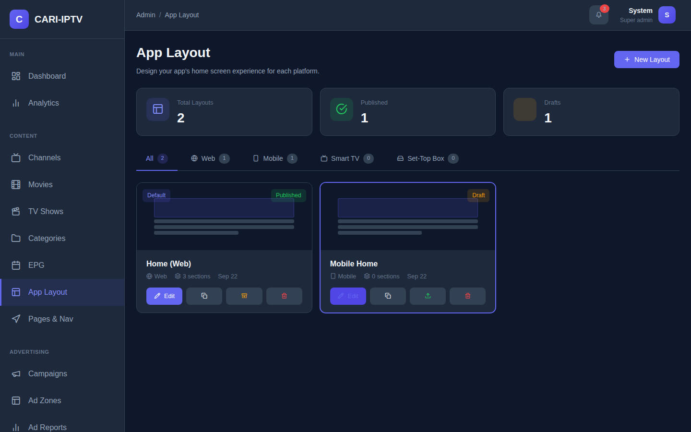

### Build a layout

1. Click **Create Layout**. Enter a name and pick the platform. The builder opens.
2. Click **Add Section** and choose a component. Useful ones:
   - **Hero Slideshow**: big rotating billboard at the top. One per layout.
   - **Content Row**: a horizontal rail of posters. Source can be Curated (you pick), Latest, Popular, Top Rated, Featured or a Category.
   - **Live Now** and **TV Guide**: driven by the EPG.
   - **Channel Grid**: featured channels.
   - **Continue Watching**, **Recommended For You**, **Because You Watched**, **Trending Now**: personalised rows, filled automatically.
   - **Packages List**: shows your packages with prices.
   - **Promo Banner**: an image with a link.
3. Click the arrow on a section to expand it. Set the **Section Title** subscribers see and any settings. For a curated section click **Add Content** to search your library, import from TMDB, or upload an image with a link.
4. Drag sections by the handle to reorder. Click the eye icon to hide a section without deleting it.
5. Click **Save Changes** on each section you edited.
6. Back on the App Layout page click **Publish** on the layout card.

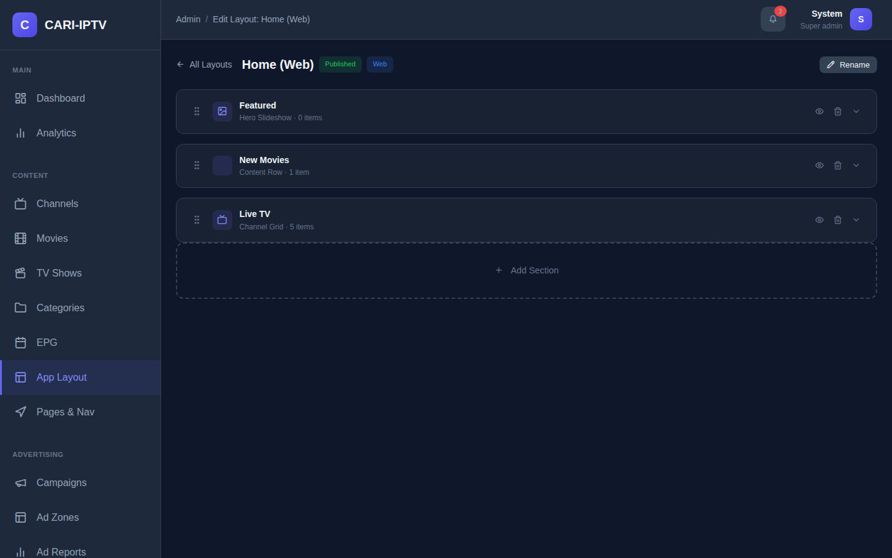

Only one layout per platform is the default at a time. Publishing makes the layout the default for its platform. Use **duplicate** to make a copy to experiment with, and **Set to Draft** to take a layout out of use.

Subscribers see layout changes within about 30 seconds, or on their next page change, without clearing anything.

### Pages and navigation

**Pages & Nav** controls which screens exist and what the menu shows, per platform.

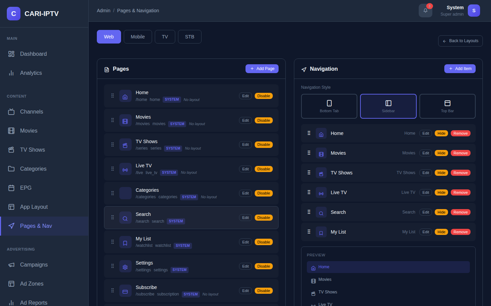

- The **Pages** panel lists the screens. Built-in ones are marked **System** and cannot be deleted. **Add Page** creates a custom page: give it a name, a URL slug, a **Page Type** and optionally a **Layout** to render. The Home, Movies, TV Shows, Live TV, Categories and Custom page types can carry a layout.
- The **Navigation** panel is the menu. Drag to reorder, **Edit** to change the label or icon, **Hide** to remove an item from the menu without deleting the page. Add items that link to a page, an external URL, or a deep link.
- On a phone the Web navigation is shown as a bottom tab bar, so keep the Web menu to five items or fewer.

### Publish a layout that works on phones

Because phones use the Web layout, design the Web layout with phones in mind:

1. In **App Layout** stay on the **Web** tab and open your layout in the builder.
2. Keep the hero small and put the most-used rows first, because phone screens show fewer rows at once. Wide rows become swipeable rails on a phone automatically.
3. **Publish** it.
4. In **Pages & Nav**, on the **Web** tab, check the navigation has at most five items.

**Check:** open `https://<ADMIN_DOMAIN>/` on a phone, sign in, and confirm the home screen shows your rows with the bottom tab bar.

If you also create and publish a **Mobile** layout, it is stored and served by the API for a future native app, but the web player will not show it.

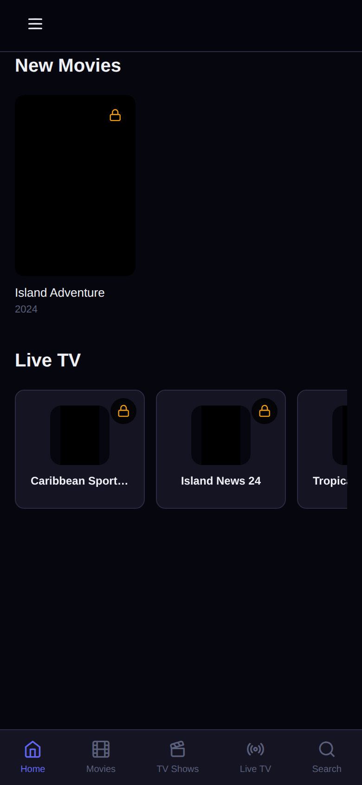

# 6. Subscribers

## 6.1 How a subscriber registers

1. The subscriber opens `https://<ADMIN_DOMAIN>/register`.
2. They enter First Name, Last Name, Email, Password (8 characters minimum) and Confirm Password. Phone, Date of Birth and Country are optional.
3. The platform emails a verification link. The link never expires.
4. They click the link, see a confirmation page, and can sign in.

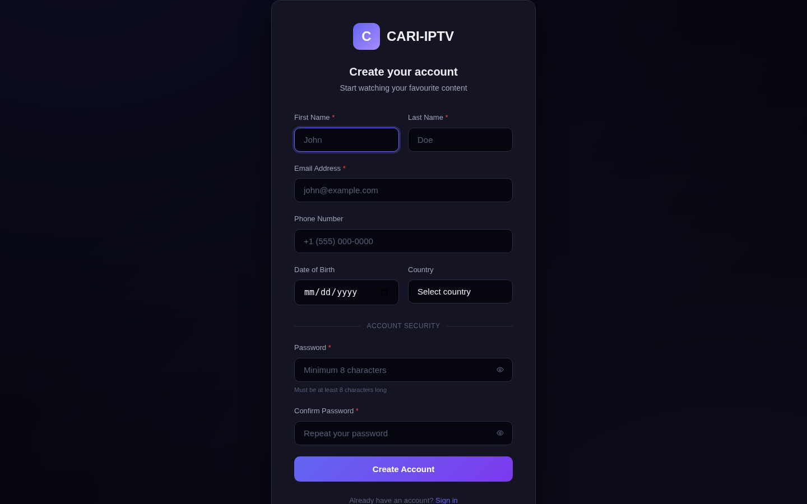

A username is created automatically from the part of the email before the `@`. The subscriber can sign in with either the username or the email.

New accounts hold **no package**. They can pick a free package or start a trial on the **Subscribe** page in the player, or staff assign one.

Registration cannot be switched off from the admin panel in this version.

## 6.2 Verification problems

If a subscriber says they never received the email:

1. Check **Settings > Email** is enabled and the test email works.
2. Ask the subscriber to try signing in. The login page then shows a **Resend verification email** button; they click it.
3. If that still fails, verify them yourself: there is no resend button in the admin panel, so open the subscriber in **Subscribers**, tick **Email Verified** and save. They can sign in straight away.

## 6.3 Sign-in

Subscribers sign in at `https://<ADMIN_DOMAIN>/login` with username or email and password. They stay signed in for up to 30 days of inactivity on that device. Sign-in is refused if the account status is not Active, if it is marked Disabled, or if the email is not verified.

## 6.4 Password reset (support procedure)

There is **no self-service password reset** for subscribers in this version. The login page has no "Forgot password" link. Use this procedure:

1. Verify the caller's identity against the details on their account (name, email, phone, address).
2. Open **Subscribers**, find the account, click **Edit**.
3. Type a new temporary password in the **Password** field. Save.
4. Give the password to the subscriber by a channel you trust, and ask them to change it. Note that the player has no change-password screen either, so if they want a different one they will call again.

The platform does not email the subscriber about the change.

## 6.5 Device limits

- Each subscriber has **Max Concurrent Connections** (default 1) on their record. This is the limit that is applied. The **Simultaneous Streams** value on the package is a label only, so when you sell a two-screen package, set the subscriber's Max Concurrent Connections to 2 by hand.
- When a subscriber signs in on one more device than allowed, the **oldest** device is silently signed out. Nobody sees an error.
- There is no list of devices and no "sign out everywhere" button in this version. To force every device off, set the subscriber's status to Inactive, save, then set it back to Active. Anyone already watching may continue for up to one hour before their session ends.

## 6.6 Managing a subscriber

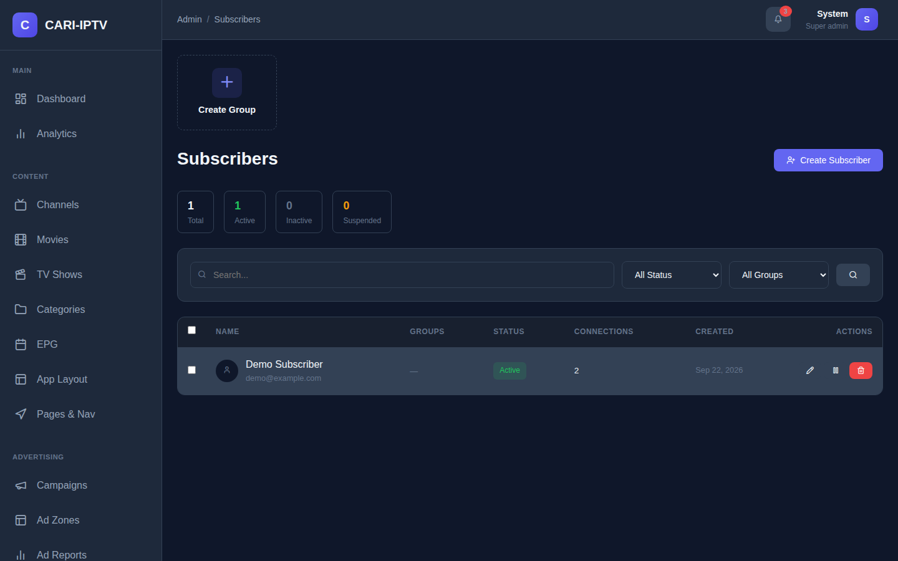

Open **Subscribers**. Search by name, username, email or phone. Filter by status or group. Tick rows for bulk **Activate**, **Deactivate**, **Suspend** or **Delete**.

**Create Subscriber** or **Edit** opens one dialog with these sections:

- **Top checkboxes**: Disabled, Email Verified, Phone Verified.
- **General**: names, username, email, phone, password, **Status** (Active, Inactive, Suspended, Expired).
- **Settings**: NPVR limit, **Max Concurrent Connections**, birthday, **Parental Pin**, **Enable Adult Content**.
- **Location**: country, city, address, ZIP.
- **Packages & Groups**: tick the **Packages** the subscriber has paid for. This is how paid subscriptions are activated. Removing a package cancels it. **Groups** are labels for your own reporting (for example DTH, Trial, Staff) and do not affect access.
- **Additional**: External ID (your billing system's reference) and internal Notes.

Status meanings are for your bookkeeping only; Inactive, Suspended, Expired and Disabled all block sign-in in the same way. Agree a convention, for example Suspended for non-payment and Expired for a lapsed contract.

The quick toggle button in the list switches between Active and Inactive.

## 6.7 Parental controls and adult content

- Every subscriber has a four-digit **Parental PIN** (default `0000`). They change it on the Profile page in the player, and staff can read or reset it in the Edit dialog. It is stored unencrypted, so treat it as low-security convenience, not a secret.
- Channels, movies, shows and packages can be flagged as adult in the database, but there is **no adult checkbox on the content forms** in this version, so this flag cannot be set from the admin panel. The subscriber-side toggle exists but has nothing to filter until that is added.

## 6.8 Cancelling and deleting accounts

- To stop service, set the status to Inactive or Suspended. This is reversible.
- **Delete** removes the account and everything attached to it: subscriptions, watch history, watchlist, ratings and devices. It cannot be undone. Subscribers cannot delete their own accounts; a written request to support is the process.

## 6.9 Subscriber self-service in the player

On the **Profile** page a subscriber can see their details, see and **Cancel** subscriptions, turn adult content on or off, set the PIN, and sign out. On the **Subscribe** page they can pick free packages and start trials.

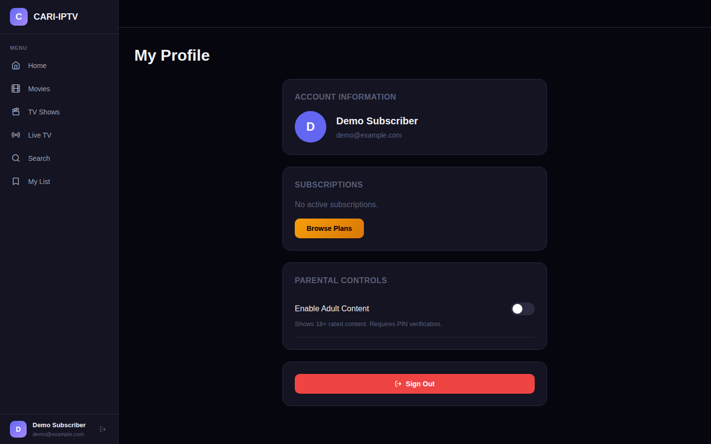

## 6.10 Support quick reference

| Subscriber says | Likely cause | What to do |
|---|---|---|
| "I registered but cannot sign in" | Email not verified, or SMTP not configured | Tick Email Verified on the account. Fix SMTP |
| "Wrong password" | Forgotten password | Section 6.4 |
| "Everything has a padlock" | No package on the account, or content not in a granted group | Assign a package. Check the content is in a group that package grants |
| "It plays on my laptop but not my phone" | 10-bit or HEVC video, or a browser without HEVC support | Re-encode with the Standard profile (section 5.5.1) |
| "Movie will not play at all" | VOD Server URL is a private address, or HTTPS mismatch (player on HTTPS, VOD on HTTP) | Set the VOD server URL to its public HTTPS address (section 3.5, 3.8) |
| "I keep getting signed out" | Another device signed in and the connection limit was reached | Raise Max Concurrent Connections |
| "I was suspended but can still watch" | Active sessions last up to one hour | Wait, or it will stop within the hour |
| "No programme guide" | Channel not mapped, or source not fetched | Section 5.3 |

# 7. Mobile app

## 7.1 What subscribers use on a phone

In this version there is no separate downloadable app. Subscribers use the same web player in the phone's browser. It adapts to the small screen: the sidebar becomes a bottom tab bar, rows become swipe rails, and the video player goes full screen in landscape.

To make it feel like an app, tell subscribers to add it to the home screen:

- **iPhone (Safari)**: open `https://<ADMIN_DOMAIN>/`, tap the Share button, then **Add to Home Screen**.
- **Android (Chrome)**: open the address, tap the three-dot menu, then **Add to Home screen** or **Install app**.

The icon and title come from your Site Logo and Site Name.

## 7.2 Branding per brand

Everything a subscriber sees as "the brand" comes from **Settings > General**: Site Name and Site Logo. If you run more than one brand, each brand needs its own installation of the platform on its own domain; there is no multi-brand switch inside one installation.

## 7.3 Layout for phones

Design the Web layout with phones in mind as described in section 5.9. Keep the Web navigation to five items. The separate Mobile platform in App Layout is not used by the web player.

## 7.4 Native apps, signing and store submission

Not applicable to this version. The platform's API already accepts `mobile`, `tv` and `stb` as platforms and serves them their own layouts and navigation, so a native app can be added later without changes to the admin workflow. When that app exists, this chapter should be extended with its build, signing and store checklist.

# 8. Operations

## 8.1 Updating the main server

Always update with a backup. Rollback is only possible when `--backup` was used (`update.sh`).

1. Choose a quiet time. The update takes a few minutes and subscribers may see errors while files are being replaced.
2. Run:

   ```bash
   curl -sSL "https://raw.githubusercontent.com/caritechsolutions/cari-iptv/<BRANCH>/update.sh?$(date +%s)" | sudo bash -s -- --backup
   ```

3. The script backs up files and the database to `/var/backups/cari-iptv/backup_<date>/`, downloads the new version, replaces the application files, runs new migrations, resets permissions and restarts services. It keeps the five most recent backups.
4. The last lines show the previous and new version numbers.

**Check:** sign in to the admin panel, open Channels and Movies, then open the player and play one channel.

If the update fails part way, the script restores the backup automatically. To go back later by hand, restore the folder and database from `/var/backups/cari-iptv/` (standard `rsync` and `mysql` commands) or ask your supplier.

Updates overwrite the application folders. Any hand edits to files under `public/`, `src/` or `templates/` are lost. Your `.env`, uploads and database are kept.

## 8.2 Updating the VOD server

```bash
curl -sSL "https://raw.githubusercontent.com/caritechsolutions/cari-iptv/<BRANCH>/vod-server/scripts/update.sh?$(date +%s)" | sudo bash
```

The script pauses running jobs, keeps a copy of the old program as `/usr/local/bin/vod-server.bak`, rebuilds, restarts and checks health. If the new version fails to start it puts the old one back automatically. Your configuration and video library are not touched. Manual rollback, printed by the script:

```bash
sudo cp /usr/local/bin/vod-server.bak /usr/local/bin/vod-server && sudo systemctl restart vod-server
```

**Check:** `curl http://localhost:8090/api/status` answers, and a paused job resumes in the Jobs list.

## 8.3 Backups

The updater's `--backup` is a good ad-hoc backup, but also schedule your own:

| What | Where | How |
|---|---|---|
| Database | Main server | `mysqldump cari_iptv > backup.sql` nightly (standard tool). Credentials are in `/var/www/cari-iptv/.env` |
| Uploads (logos, posters, subtitles) | `/var/www/cari-iptv/public/uploads/` | Copy to another machine |
| `.env` | `/var/www/cari-iptv/.env` | Copy once and after any change |
| VOD configuration | `/etc/vod-server/vod-server.conf` | Copy. It contains the API key |
| VOD library | `/var/lib/vod-server/library/` and `/var/lib/vod-server/vod-server.db` | Large. Copy or snapshot the disk |

## 8.4 Logs

| Log | Location |
|---|---|
| Application errors | `/var/www/cari-iptv/storage/logs/php-error.log` |
| EPG fetch | `/var/www/cari-iptv/storage/logs/epg.log` |
| Recommendations | `/var/www/cari-iptv/storage/logs/recommendations.log` |
| Web server | `/var/log/nginx/cari-iptv-error.log` and `-access.log` |
| VOD server | `/var/log/vod-server/vod-server.log`, or `journalctl -u vod-server -f` |

These logs are not rotated automatically. Check their size monthly and clear or rotate them.

## 8.5 Monitoring

- **Dashboard** in the admin panel: add the Disk Space and Memory Usage panels.
- **Analytics**: viewers now, buffering and error trends, top content, churn risk.
- **VOD server dashboard** (port 8090): CPU, memory, disk, active jobs.
- `systemctl status nginx php8.2-fpm mysql` on the main server and `systemctl status vod-server` on the VOD server.

## 8.6 Common faults

| Symptom | Cause | Fix |
|---|---|---|
| Admin panel shows a blank or error page | Database down or wrong credentials in `.env` | `sudo systemctl status mysql`; compare `.env` with the database user |
| Player loads but no video ever starts | Browser cannot reach the CDN that hosts the video engine, or the server has no internet | Allow outbound access; the video engine is loaded from jsdelivr.net |
| Live channel does not play | Stream URL wrong, offline, or HTTP stream on an HTTPS site | Test the URL in VLC. Serve streams over HTTPS |
| Movie shows Processing forever | VOD server stopped, or job failed while the panel was closed | Check the Jobs page on the VOD server; restart it; re-submit |
| Transcode fails immediately | Disk below `min_free_space_gb`, or unreadable file | Free space; re-encode the source with FFmpeg |
| Guide is empty | Source not fetched or channels unmapped | Fetch now; check mappings; read `epg.log` |
| Guide times are wrong by hours | Source Timezone set wrongly | Edit the source's timezone and fetch again |
| Verification emails not arriving | SMTP disabled or wrong; provider blocking | Send Test Email; check spam; check port 587 outbound |
| Uploads fail on large files | Size above the 12 GB limit or a proxy in front with a smaller limit | Split or shrink the file; raise the proxy limit |
| Recommendations never appear | Nightly job has not run yet, or AI not configured | Wait for the 03:00 run; check `recommendations.log` |

## 8.7 Scheduled jobs

Installed to `/etc/cron.d/cari-iptv` by the installer and rewritten by every update. Do not edit the file; changes are lost.

| When | Job |
|---|---|
| Every 5 minutes | Fetch EPG sources that are due |
| 02:00 daily | Delete programmes older than two days |
| 03:00 daily | Build AI taste profiles and recommendations for up to 100 subscribers, and prune analytics older than 90 days |

# 9. Security notes

This section is deliberately frank so you can make informed decisions.

## 9.1 What is protected

- Admin sign-in locks an account for 15 minutes after five failed attempts. Admin sessions expire after two hours of inactivity unless "Keep me logged in" was ticked.
- Passwords for staff and subscribers are stored hashed.
- All player and API requests require a signed-in subscriber. Stream links are not listed to anonymous visitors.
- Every form in the admin panel is protected against cross-site request forgery.
- Uploaded images are re-encoded, which strips embedded content.
- The VOD server requires its API key for every management call.

## 9.2 What is not protected, and what to do about it

| Gap | Effect | Recommendation |
|---|---|---|
| No HTTPS from the installer | Passwords and tokens in clear text | Section 3.7 and 3.8 before go-live |
| No firewall from the installer | Database and AI ports are local-only, but 8090 on the VOD server is open to the world | Restrict 8090 to the main server, and expose the VOD server to subscribers only through HTTPS on 443 |
| Entitlements are applied by the player, not the server | A technically capable subscriber can request any stream link with their own login, regardless of package | Treat packages as presentation. Plan for server-side enforcement in a future version. Keep a paper trail of subscriptions for disputes |
| Adult filtering is applied by the player only | Same as above | Same |
| The DRM key endpoint on both servers answers without a login | Content encryption protects files on disk and in transit, but is not access control. Anyone who knows a content id can fetch its key | Do not describe the service as DRM-protected to rights holders. Restrict who can reach the VOD server |
| Ad tracking endpoints are public | Impression and click counts could be inflated | Treat ad reports as indicative; reconcile with the advertiser's own numbers |
| Admin roles are not enforced | Every admin account can do everything, including managing other admins and settings | Create as few admin accounts as possible. Use strong unique passwords. Review Admin Users monthly |
| A suspended subscriber keeps a valid session for up to one hour | Delayed cut-off | Accept, or ask your supplier for immediate revocation |
| Parental PIN stored unencrypted | Staff can read it | Tell subscribers not to reuse a banking PIN |
| The player loads its video engine and fonts from public CDNs | If those CDNs are unreachable the player breaks | Consider hosting them locally with your supplier |
| Local customisations are overwritten by updates | Silent loss of branding edits | Only brand through Settings |

## 9.3 Recommended hardening

1. HTTPS on both servers, with HTTP redirected.
2. Firewall: main server 80 and 443 only; VOD server 443 only (or 8090 only from the main server's address).
3. Change the admin password on day one and delete `INSTALL_CREDENTIALS.txt`.
4. One admin account per person, no shared logins.
5. Set `APP_DEBUG=false` in `.env` (the installer does this).
6. Back up nightly and test a restore quarterly.
7. Keep the VOD server's API key out of tickets and chat.

# Appendix A. API reference summary

The API is what the player uses. Base address `https://<ADMIN_DOMAIN>/api/v1`. Responses are JSON. Sign-in returns an access token valid for one hour and a refresh token valid for 30 days; the access token is sent as `Authorization: Bearer <token>`.

| Group | Endpoints | Login required |
|---|---|---|
| Account | `POST auth/register`, `auth/login`, `auth/refresh`, `auth/logout`, `auth/resend-verification`; `GET auth/verify-email/{token}` | No |
| Account | `GET auth/me`, `auth/entitlements`, `auth/continue-watching`, `auth/watchlist`, `auth/rating`; `POST auth/watch-progress`, `auth/watchlist/toggle`, `auth/subscribe`, `auth/unsubscribe`, `auth/update-profile`, `auth/rate` | Yes |
| Content | `GET channels`, `channels/{id}`, `movies`, `movies/featured`, `movies/{id}`, `series`, `series/{id}`, `episodes/{id}`, `categories`, `person/{id}`, `search`, `manifest` | Yes |
| Guide | `GET epg`, `epg/{channelId}`, `epg/programme-info` | Yes |
| App | `GET app/config/{platform}`, `app/layout/{platform}`, `app/navigation/{platform}`, `app/pages/{platform}` | Yes |
| Ads | `GET ads/serve`, `ads/breaks`, `ads/overlay-settings`; `POST ads/impression`, `ads/event` | No |
| DRM | `GET/POST drm/license` (login), `GET drm/key/{contentId}` (no login) | Mixed |
| Analytics | `POST analytics/event`, `analytics/batch`, `analytics/qoe`, `analytics/impressions`, `analytics/share`; `GET recommendations`, `recommendations/profile` | Yes |

VOD server API (base `http://<VOD_DOMAIN>:8090/api`, header `X-API-Key`): `status`, `config`, `profiles`, `jobs`, `content`, `upload`, `browse`. `status` and the DRM key endpoints do not require the key.

# Appendix B. Configuration reference

## B.1 Admin settings keys

| Group | Keys |
|---|---|
| general | site_name, site_logo, site_url, admin_email |
| smtp | enabled, host, port, encryption, username, password, from_email, from_name |
| metadata | tmdb_api_key, fanart_tv_api_key, youtube_api_key, auto_fetch_metadata |
| subtitles | opensubtitles_api_key, opensubtitles_username, opensubtitles_password, preferred_languages, auto_fetch_subtitles |
| ai | ai_enabled, provider, ollama_url, ollama_model, openai_api_key, openai_model, anthropic_api_key, anthropic_model |
| image | auto_optimize, keep_originals, webp_quality |
| ads | banner_enabled, banner_initial_delay, banner_display_duration, banner_repeat_interval, scroller_enabled, scroller_initial_delay, scroller_repeat_interval |

## B.2 `.env` on the main server

```
APP_ENV=production
APP_DEBUG=false
APP_URL=https://<ADMIN_DOMAIN>
DB_HOST=localhost
DB_PORT=3306
DB_DATABASE=cari_iptv
DB_USERNAME=cari_iptv
DB_PASSWORD=<DB_PASSWORD>
```

## B.3 `vod-server.conf` sections

`[server]` port, bind_address, api_key, log_file, log_level, www_root. `[ssl]` enabled, cert_file, key_file, auto_self_signed. `[acme]` enabled, http_port, webroot, domain, https_port. `[storage]` library_path, temp_path, min_free_space_gb, database_path. `[transcoding]` max_concurrent_jobs, ffmpeg_path, ffprobe_path, mp4box_path, default_profile, segment_duration, gop_size, poll_interval, hwaccel, gpu_device. `[thumbnails]` enabled, interval, width, height, columns, quality. `[subtitles]` enabled, auto_extract. `[cluster]` node_name, health_check_interval, offline_threshold, max_concurrent_migrations. `[drm]` enabled, scheme, key_server_url, auto_generate. `[profile:name]` codec, preset, crf, renditions, audio_codec, audio_bitrate.

## B.4 Installer options

`install.sh`: `--db-pass=`, `--admin-pass=`, `--admin-email=`, `--install-dir=`, `--port=`.
`update.sh`: `--backup`, `--backup-dir=`, `--branch=`, `--install-dir=`.

# Appendix C. Glossary

| Term | Meaning |
|---|---|
| ABR | Adaptive bitrate. The player switches between quality levels as the connection changes |
| Content group | A bundle of channels, movies, shows or categories that a package grants |
| DVB, EIT | Satellite and cable broadcast standard; EIT is the programme guide table carried inside it |
| EPG | Electronic programme guide. What is on, now and next |
| HLS | HTTP Live Streaming. The `.m3u8` stream format the player uses |
| Layout | The arrangement of rows and sections on a player screen, designed in App Layout |
| Package | A subscription plan with a price that grants content groups |
| Profile (transcode) | A quality ladder used by the VOD server, such as Standard or Low Bandwidth |
| Rendition | One quality level within a ladder, for example 720p |
| SDR, HDR | Standard and high dynamic range. HDR must be converted before upload |
| TMDB | The Movie Database, source of metadata and artwork |
| VOD | Video on demand: movies and episodes, as opposed to live TV |
| XMLTV | A file format for programme guides |
| yuv420p | The 8-bit 4:2:0 colour format every device decodes |

# Appendix D. Where the documentation and the code disagree

Found while writing this manual. The manual follows the code.

| Existing documentation says | The code does |
|---|---|
| README: install from the `main` branch | The scripts are pinned to a feature branch. Use the branch your supplier names |
| CLAUDE.md: the install script's branch line is near line 1357 | It is line 1377 |
| CLAUDE.md: `/admin/vod-server` is the VOD Server page with profile management | It redirects to Settings > Integrations. Profiles are managed on the VOD server's own page |
| CLAUDE.md: 10 layout section types | 17 section types |
| CLAUDE.md: ads are served from `/admin/ads/api/...` | The player uses the public `/api/v1/ads/...` endpoints |
| CLAUDE.md: roles control access | Roles and permissions are never checked |
| README and CLAUDE.md: packages control access | Access is decided by the player only |
| Migration 024 comment: seeds VOD server settings | Creates the table only |
| Migration 004 seeds `metadata.fanart_api_key` and `image.generate_sizes` | The panel uses `metadata.fanart_tv_api_key` and `image.auto_optimize`; the seeded keys are unused |
| Migration 019 name: seeds default packages | Seeds four empty content groups. The demo packages come from the installer |
| Sidebar: Activity Log | No such page; the link gives a 404 |
| Channel form: "Published: channel is visible to users" | The player ignores Published; only Active matters |
| Channel form: Include in Packages | Not read by entitlement checks |
| Player: "Invalid or expired verification link" | Links never expire; only invalid or already used |
| App Layout: separate Mobile, Smart TV and Set-Top Box layouts | The web player always requests the Web layout, including on phones |

# Appendix E. Current limitations at a glance

1. No subscriber password reset or change-password screen.
2. No device list or sign-out-everywhere for subscribers.
3. Packages are not enforced by the server; the player shows padlocks only.
4. Package limits (streams, quality, platforms, countries, tax) are descriptive.
5. No payment gateway; paid packages are activated by staff.
6. Subscriptions do not expire automatically except by ignoring past expiry dates in entitlement checks.
7. Adult flag cannot be set on content from the admin panel.
8. VOD server Public URL cannot be set from the admin panel; the Server URL must be publicly reachable.
9. No M3U playlist import; IPTV-org is the only bulk channel import.
10. Channel Published, Backup Stream URL, Age Limit, OS Platforms and similar fields are stored but unused.
11. Admin roles and page permissions are not enforced.
12. The Activity Log menu item is a dead link.
13. A/B tests cannot be created from the admin panel.
14. Registration cannot be turned off from the admin panel.
15. Colours of the player are not configurable.
21. Mobile, Smart TV and Set-Top Box layouts are stored but not used by any client yet.
16. No HTTPS or firewall from the main installer.
17. Update "maintenance mode" does not actually block visitors.
18. Log files are not rotated.
19. Transcoder does not tone-map HDR, preserve aspect ratio, or skip upscaling.
20. DRM key endpoint is public by design.
